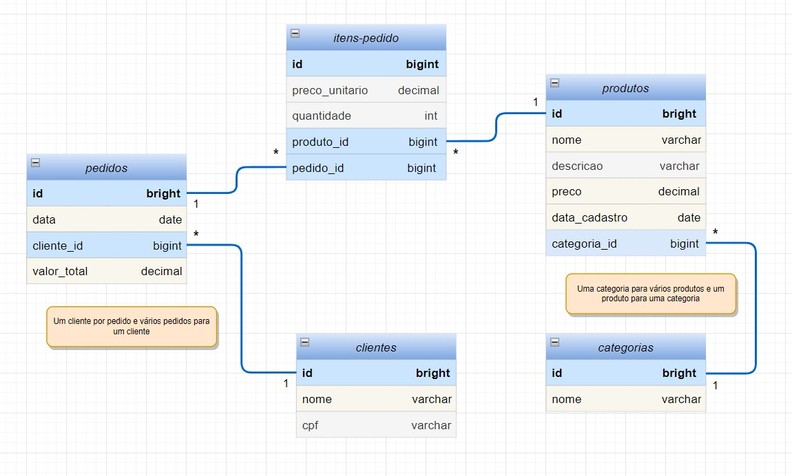

# JPA-Hibernate

Project of a program using database through JPA and using H2 database, for studies. 

In this project, a directional relationship was created between entities in order to create an order system, using customer, product and order records.

